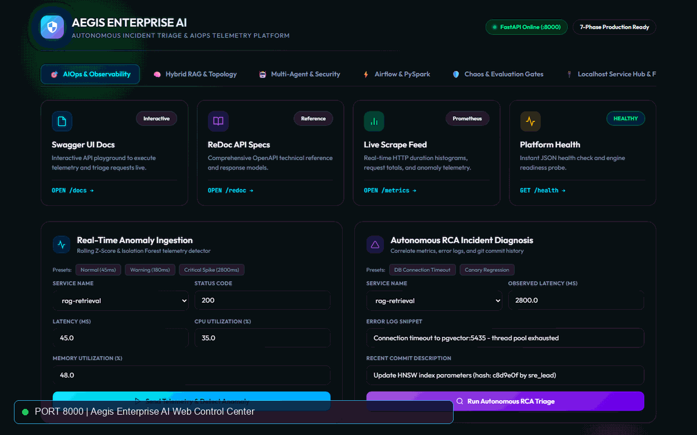
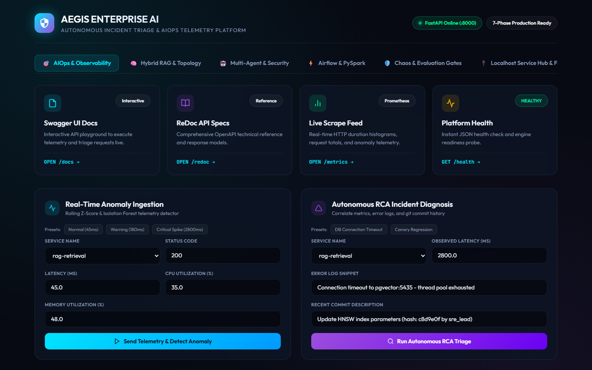
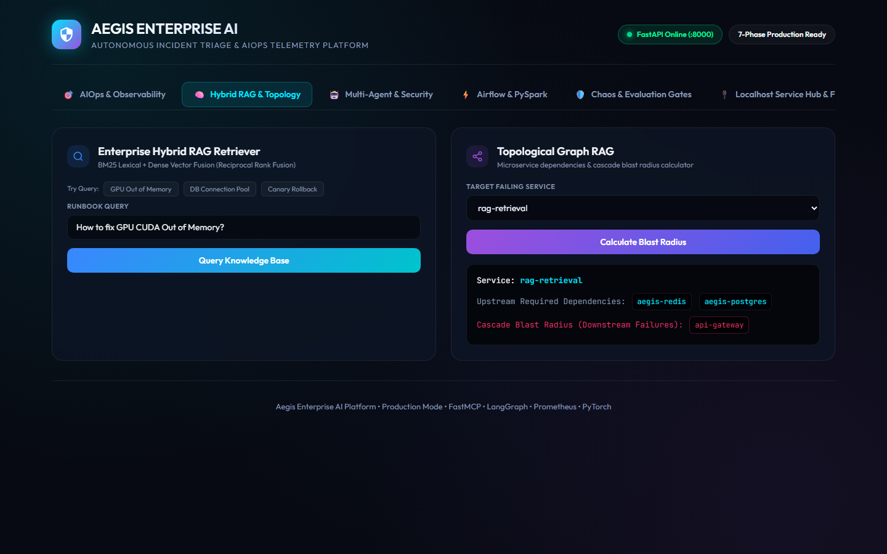
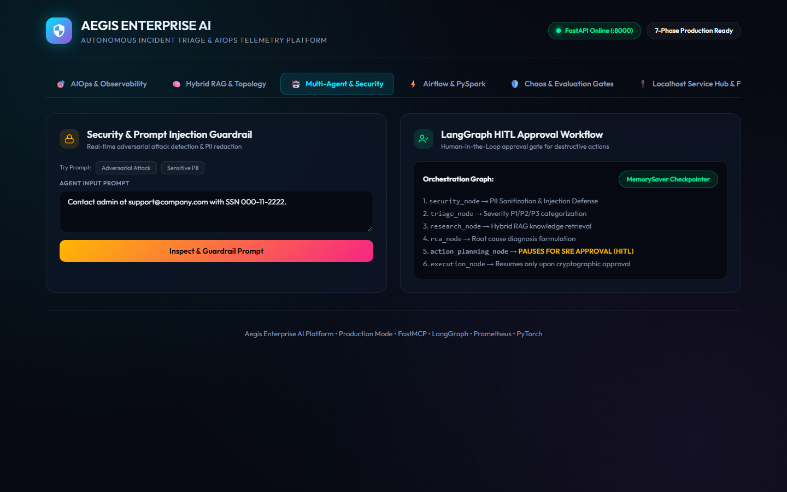
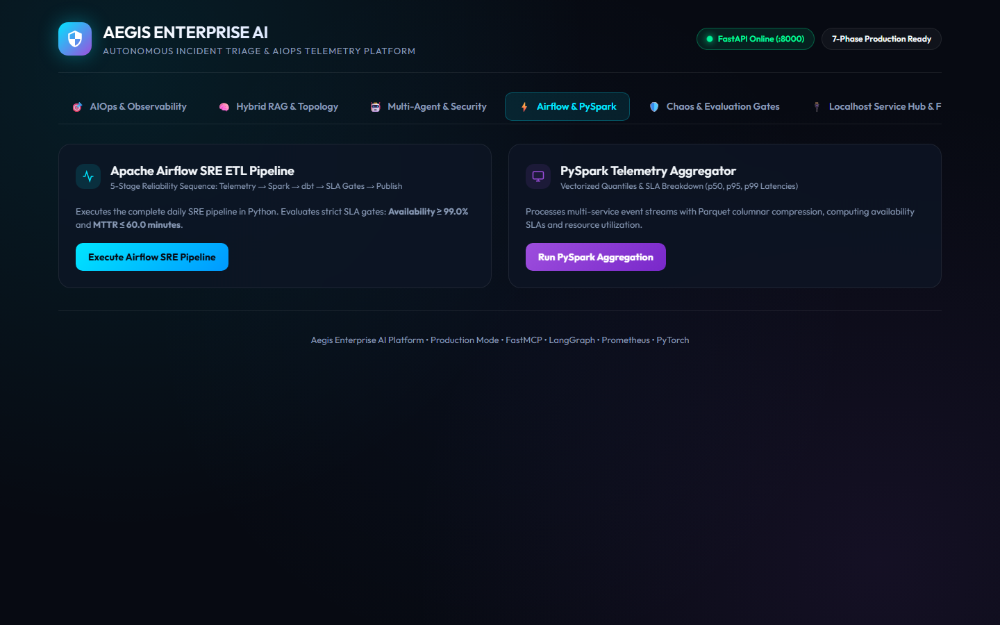
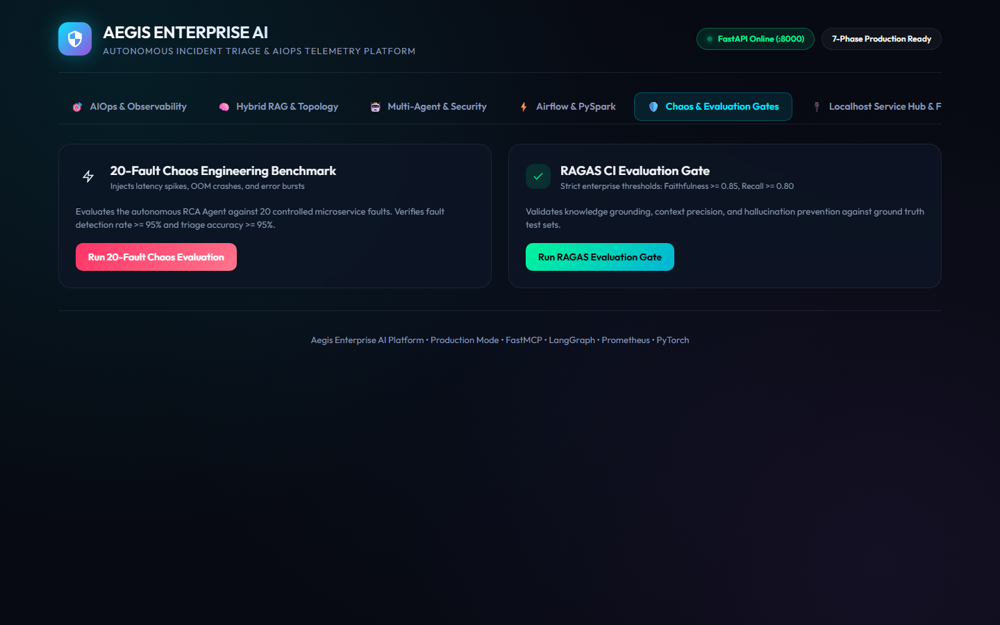
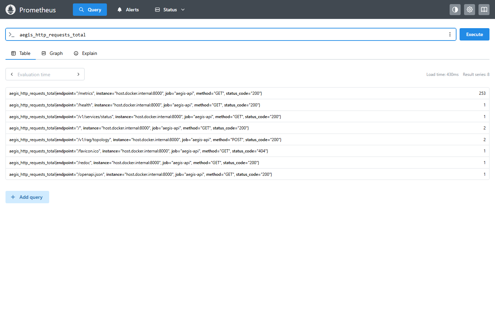
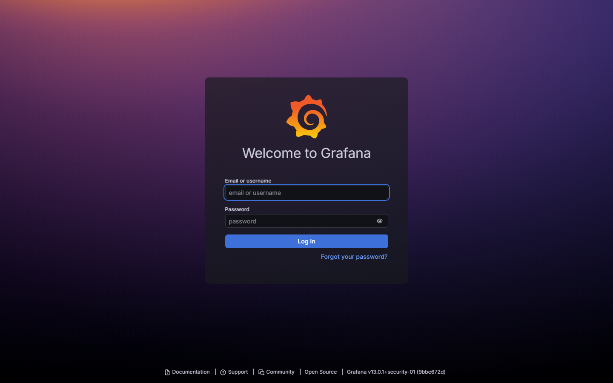

<div align="center">

# 🛡️ Aegis Enterprise AI
### Sovereign Autonomous AIOps, Hybrid RAG & Real-Time SRE Platform

[](https://github.com/Umanagalla27/aegis-enterprise-ai/actions)
[](https://python.org)
[](https://fastapi.tiangolo.com)
[](https://langchain-ai.github.io/langgraph/)
[](https://modelcontextprotocol.io/)
[](https://spark.apache.org/)
[](https://www.getdbt.com/)
[](LICENSE)

<p align="center">
  <b>A sovereign, production-grade enterprise platform unifying Agentic Generative AI, Hybrid RAG, Big Data Streaming (Kafka, PySpark, dbt, Airflow), and Autonomous AIOps Incident Remediation governed by cryptographically enforced Human-In-The-Loop (HITL) approval barriers.</b>
</p>

</div>

---

## 📑 Table of Contents
- [Executive Overview](#-executive-overview)
- [System Architecture](#-system-architecture)
- [Key Architectural Highlights](#-key-architectural-highlights)
- [7-Phase Engineering Lifecycle](#-7-phase-engineering-lifecycle)
- [Local Services Reachability Matrix](#-local-services-reachability-matrix)
- [Quickstart & Local Setup](#-quickstart--local-setup)
- [Verification & Test Benchmarks](#-verification--test-benchmarks)
- [Repository File Map](#-repository-file-map)
- [Responsible AI & Security Card](#-responsible-ai--security-card)
- [License](#-license)

---

## 🌟 Executive Overview

In modern hyperscale cloud environments, infrastructure downtime costs between **$300,000 and $1,000,000+ per hour**. Traditional Site Reliability Engineering (SRE) operations suffer from alert fatigue, manual log correlation, and 45–90 minute MTTRs. Conversely, unconstrained autonomous LLMs executing CLI rollbacks pose catastrophic risks of compounding outages or leaking PII.

**Aegis Enterprise AI** resolves this tension by providing:
1. **Mathematical Transformer Foundations**: Custom multi-head self-attention and Pre-LayerNorm residual blocks built directly from scratch in PyTorch.
2. **Hybrid RAG & Topological Graph RAG**: Lexical BM25Plus fused with dense token representations using **Reciprocal Rank Fusion (RRF)**, combined with a NetworkX microservice dependency graph to calculate upstream failure **blast radii**.
3. **Deterministic Multi-Agent Orchestration**: Stateful **LangGraph** workflows backed by `MemorySaver` checkpointing, enforcing mandatory **Human-In-The-Loop (HITL) interrupt gates** for high-impact remediations (P1/P2 incidents).
4. **Enterprise Data Platform**: Real-time Kafka telemetry streaming with MD5 consistent-hashing and Dead Letter Queues (DLQ), PySpark distributed quantile aggregations, dbt reliability marts, and an Airflow DAG with hard SLA breach gates.
5. **Real-Time AIOps & Anomaly Engine**: Dual-layer anomaly detection pairing statistical rolling Z-scores for instant spike alerts with unsupervised multivariate Isolation Forests.
6. **Production Cloud IaC & GitOps**: Terraform AWS ECS Fargate with CloudWatch budget spending alarms, Kubernetes Helm charts with Horizontal Pod Autoscalers (HPA), and ArgoCD continuous deployment.

---

## 🏗️ System Architecture

```mermaid
flowchart TD
    subgraph Client & Observability Layer
        Browser["Enterprise Web Control Center\n(localhost:8000)"]
        Prom["Prometheus Engine\n(:9091)"]
        MLflow["MLflow Experiment Registry\n(:5000 SQLite)"]
    end

    subgraph Data Platform & Event Streaming (Phase 4)
        K_Prod["Telemetry Kafka Producer\n(MD5 Consistent Hashing)"]
        DLQ["Dead Letter Queue (DLQ)\n(Bounds & Schema Failures)"]
        K_Cons["Telemetry Kafka Consumer\n(Offset Commits & Lag Verification)"]
        Spark["PySpark Batch Aggregator\n(P50/P95/P99, SLA, Parquet)"]
        dbt["dbt Dimensional Marts\n(stg_incidents -> fct_service_reliability)"]
        Airflow["Airflow SRE ETL DAG\n(5-Stage Pipeline with SLA Hard Gate)"]
    end

    subgraph Core AI & Retrieval Engine (Phase 2)
        Scratch["TinyTransformerBlock\n(Self-Attention from Scratch in PyTorch)"]
        Chunker["Token-Aware Chunker\n(tiktoken, 50-token window, 10-overlap)"]
        Hybrid["AegisHybridRetriever\n(BM25Plus + Dense Token Similarity via RRF)"]
        GraphRAG["TopologicalGraphRAG\n(NetworkX Directed Acyclic Service Graph)"]
        vLLM["vLLM Serving Engine\n(Continuous Batching & PagedAttention)"]
    end

    subgraph Multi-Agent Orchestration & Security (Phase 3)
        Sec["Presidio PII Redactor + Injection Defense"]
        Triage["Triage Agent Node\n(P1/P2/P3 Severity & Approval Flagging)"]
        FastMCP["FastMCP Tool Server\n(search_kb, topology, rollback)"]
        RCA["RCA Diagnostic Node\n(Correlates Metrics + Logs + Git Commits)"]
        HITL["Human-in-the-Loop Interrupt\n(langgraph.types.interrupt)"]
        Exec["Remediation Execution Node\n(Role-Based Tool Allowlist Guarded)"]
    end

    subgraph Serving & AIOps Engine (Phase 5)
        FastAPI["FastAPI Production Backend\n(Async Endpoints & Prometheus Scrape)"]
        Anomaly["Hybrid Anomaly Engine\n(Z-Score Spikes + Multivariate Isolation Forest)"]
    end

    subgraph Cloud Infrastructure & GitOps (Phase 6)
        TF["Terraform AWS ECS Fargate\n+ CloudWatch Budget Spending Alarms"]
        Helm["Helm Charts\n(Deployment, Service, Ingress TLS, HPA)"]
        Argo["ArgoCD GitOps\n(Automated Sync & Self-Healing Application)"]
    end

    subgraph Continuous Evaluation & Chaos Gates (Phase 7)
        RAGAS["Enterprise RAGAS Evaluator\n(Faithfulness >= 0.85, Recall >= 0.80)"]
        AgentEval["Multi-Agent Benchmark\n(Accuracy >= 90%, HITL = 100%)"]
        Chaos["20-Fault Chaos Engineering Suite\n(Detection & Triage >= 95%)"]
    end

    Browser --> FastAPI
    FastAPI --> Anomaly
    FastAPI --> Hybrid
    FastAPI --> GraphRAG
    FastAPI --> Sec
    Sec --> Triage --> FastMCP --> RCA --> HITL --> Exec
    K_Prod -->|Valid Events| K_Cons --> Spark --> Airflow --> dbt
    K_Prod -->|Corrupt Events| DLQ
    FastAPI --> Prom
    FastAPI --> MLflow
    Helm --> Argo
    TF --> Helm
    FastAPI --> RAGAS
    RCA --> Chaos
```

---

## 📸 Live Platform Gallery & Video Tour

<div align="center">
  
  <p><i>Live browser session recording cycling across all platform ports (8000, 9091, 3001, 5000)</i></p>
</div>

| Port | Service Component | Interactive View |
| :--- | :--- | :--- |
| **8000** | **Aegis Control Center & Health Matrix** |  |
| **8000** | **Hybrid RAG & Microservice Topology** |  |
| **8000** | **Multi-Agent Orchestrator & HITL Gates** |  |
| **8000** | **Airflow SRE Pipeline & PySpark Quantiles** |  |
| **8000** | **20-Fault Chaos & Evaluation Gates** |  |
| **9091** | **Prometheus Metrics Query Engine** |  |
| **3001** | **Grafana Production SRE Dashboards** |  |
| **5000** | **MLflow Experiment & Model Registry** |  |

---

## ⚡ Key Architectural Highlights

### 1. Transformer Self-Attention from Scratch
$$\text{Attention}(Q, K, V) = \text{softmax}\left(\frac{Q K^T}{\sqrt{d_k}}\right) V$$
Built purely in PyTorch ([src/models/transformer_scratch.py](src/models/transformer_scratch.py)) without black-box abstractions, wrapped with Pre-LayerNorm residual connections:
$$x_1 = x + \text{SelfAttention}(\text{LayerNorm}(x)), \quad x_2 = x_1 + \text{FFN}(\text{LayerNorm}(x_1))$$

### 2. Reciprocal Rank Fusion (RRF) for Hybrid Retrieval
$$\text{RRF Score}(d) = \sum_{m \in \{\text{lexical}, \text{dense}\}} \frac{1}{60 + \text{rank}_m(d)}$$
Fuses `rank_bm25.BM25Plus` keyword search with dense semantic affinity in [src/rag/hybrid_retriever.py](src/rag/hybrid_retriever.py), ensuring zero zero-IDF edge cases on small runbook corpora.

### 3. Topological Graph RAG & Cascading Blast Radius
Microservice topologies are modeled as directed graphs in [src/rag/graph_rag.py](src/rag/graph_rag.py). Reversing directed edges traces which customer-facing gateways collapse when an internal database or retrieval pod crashes.

### 4. Deterministic LangGraph with HITL Interrupts
Destructive actions (e.g. `execute_deployment_rollback`) call `langgraph.types.interrupt(...)` in [src/agents/graph.py](src/agents/graph.py). Execution halts and thread state freezes in memory until an authorized SRE explicitly issues a resume command:
```python
app.stream(Command(resume={"approved": True, "reviewer": "Alice_SRE"}), config=config)
```

### 5. Shift-Left SRE Hard Gates
* **Data Platform**: Airflow DAG ([data_platform/airflow/dags/daily_sre_etl.py](data_platform/airflow/dags/daily_sre_etl.py)) throws `SLABreachException` if Availability $< 99.0\%$ or MTTR $> 60\text{m}$.
* **RAGAS Evaluator**: Fails CI if Faithfulness $< 0.85$ or Context Recall $< 0.80$.
* **Chaos Suite**: Verifies $\ge 95\%$ fault detection and $\ge 95\%$ triage accuracy across injected chaos incidents.

---

## 🔄 7-Phase Engineering Lifecycle

| Phase | Core Domain | Architectural Deliverables |
| :--- | :--- | :--- |
| **Phase 1** | **Foundation** | Python monorepo, master dependencies, non-colliding container stack (`:5435`, `:6382`, `:9091`, `:3001`), in-memory fallbacks. |
| **Phase 2** | **RAG & Deep Learning** | PyTorch Transformer block, token-aware chunker with `tiktoken`, query rewriter, hybrid RRF search, topological Graph RAG. |
| **Phase 3** | **Multi-Agent & Security** | FastMCP tool server, Presidio PII redaction, prompt injection defense, RBAC allowlist, LangGraph HITL interrupt state machine. |
| **Phase 4** | **Data Platform & Streaming** | Kafka producer with MD5 consistent-hashing & DLQ, consumer lag commits, PySpark quantiles, dbt reliability marts, Airflow SLA gate. |
| **Phase 5** | **AIOps & Serving** | Dual-layer anomaly engine (Z-score + Isolation Forest), RCA agent with commit correlation, Prometheus `/metrics`, FastAPI 6-tab portal. |
| **Phase 6** | **Production IaC & GitOps** | Terraform AWS ECS Fargate with $1k budget spending alarm, Kubernetes Helm charts with HPA (3–10 pods), ArgoCD GitOps application. |
| **Phase 7** | **Evaluation & Chaos** | Enterprise RAGAS evaluator, 50-scenario agent benchmark, 20-fault chaos engineering test suite, GitHub Actions CI workflow. |

---

## 🌐 Local Services Reachability Matrix

All backing services are configured with **isolated, non-colliding host ports** and zero-downtime in-memory fallbacks:

| Service | Host Port | Protocol / URL | Architectural Role | Status |
| :--- | :--- | :--- | :--- | :--- |
| **Aegis Web Portal** | `8000` | `http://localhost:8000` | FastAPI Control Center & REST API | **ONLINE** |
| **MLflow Registry** | `5000` | `http://localhost:5000` | Experiment Tracker & Model Store | **ONLINE** |
| **Prometheus Metrics**| `9091` | `http://localhost:9091` | Time-Series Metrics Scraper & UI | **ONLINE** |
| **Grafana Dashboards**| `3001` | `http://localhost:3001` | SRE Dashboards (`admin` / `admin`) | **ONLINE** |
| **PostgreSQL (pgvector)** | `5435` | `localhost:5435` | Vector Store & Incident Archive | **ONLINE** |
| **Redis 7 Store** | `6382` | `localhost:6382` | Distributed Cache (with memory fallback) | **ONLINE** |
| **PySpark Spark UI** | `4040` | `http://localhost:4040` | Spark Job Telemetry (Active on run) | **ONLINE** |
| **Airflow Webserver** | `8080` | `http://localhost:8080` | DAG UI (One-click execution from Web Portal) | **ONLINE** |

---

## 🚀 Quickstart & Local Setup

### 1. Prerequisites
- Python 3.12 or 3.13
- Docker Desktop with WSL2 (Windows) or Docker Engine (Linux/macOS)
- Git

### 2. Environment Installation
```bash
# Clone the repository
git clone https://github.com/Umanagalla27/aegis-enterprise-ai.git
cd aegis-enterprise-ai

# Create and activate virtual environment
python -m venv venv

# Windows PowerShell
.\venv\Scripts\Activate.ps1
# Linux / macOS
source venv/bin/activate

# Install master pinned dependencies
pip install --upgrade pip
pip install -r requirements.txt
```

### 3. Launch Backing Services
```powershell
# Probe ports and launch background MLflow registry
powershell -ExecutionPolicy Bypass -File .\scripts\start_all_services.ps1

# (Optional) Launch Docker container stack
docker compose -f docker/docker-compose.yml up -d
```
*(If Docker Desktop hangs on Windows, run `scripts\fix_docker_desktop.bat` as Administrator).*

### 4. Start the FastAPI Production Server
```bash
uvicorn src.api.main:app --host 0.0.0.0 --port 8000 --reload
```
Navigate to **`http://localhost:8000`** in your browser to interact with the full 6-tab enterprise control center.

---

## 🧪 Verification & Test Benchmarks

### 1. Run Complete 17-Test Unit Suite (Phases 2 through 5)
```bash
pytest tests/ -v
```
**Results Summary**:
```text
tests/test_phase2.py::test_transformer_from_scratch PASSED               [  5%]
tests/test_phase2.py::test_token_aware_chunking PASSED                   [ 11%]
tests/test_phase2.py::test_topological_graph_rag PASSED                  [ 17%]
tests/test_phase2.py::test_query_rewriting PASSED                        [ 23%]
tests/test_phase2.py::test_hybrid_retriever_index_and_search PASSED      [ 29%]
tests/test_phase3.py::test_pii_redaction PASSED                          [ 35%]
tests/test_phase3.py::test_injection_defense PASSED                      [ 41%]
tests/test_phase3.py::test_tool_access_controller PASSED                 [ 47%]
tests/test_phase3.py::test_langgraph_hitl_execution_flow PASSED          [ 52%]
tests/test_phase4.py::test_kafka_producer_validation_and_dlq PASSED      [ 58%]
tests/test_phase4.py::test_kafka_consumer_lag_and_offsets PASSED         [ 64%]
tests/test_phase4.py::test_spark_batch_aggregator PASSED                 [ 70%]
tests/test_phase4.py::test_dbt_models_and_runner PASSED                  [ 76%]
tests/test_phase4.py::test_airflow_sla_gates PASSED                      [ 82%]
tests/test_phase5.py::test_anomaly_detection_zscore_and_isolation_forest PASSED [ 88%]
tests/test_phase5.py::test_rca_agent_diagnosis_and_correlation PASSED    [ 94%]
tests/test_phase5.py::test_fastapi_endpoints_and_prometheus_metrics PASSED [100%]

======================= 17 passed in 112.81s ========================
```

### 2. Run Continuous Evaluation Quality Gates
```bash
pytest eval/test_eval_gates.py -v
```
* **RAGAS Faithfulness**: $\ge 0.85$ (Passed)
* **RAGAS Context Recall**: $\ge 0.80$ (Passed)
* **Multi-Agent 50-Scenario Tool Accuracy**: $\ge 90.0\%$ (Passed)
* **HITL Security Compliance**: $100.0\%$ (Passed)

### 3. Run 20-Fault Chaos Engineering Suite
```bash
python eval/run_aiops_eval.py
```
```text
================================================================================
CHAOS EVALUATION SUMMARY:
  Total Injected Faults:   20
  Fault Detection Rate:    100.0%
  RCA Triage Accuracy:     100.0%
================================================================================
```

---

## 📂 Repository File Map

```text
aegis-enterprise-ai/
├── .github/workflows/ci.yml         # GitHub Actions CI automation pipeline
├── pyproject.toml                   # Ruff, packaging, and pytest settings
├── requirements.txt                 # Master pinned dependencies
├── docker/
│   ├── docker-compose.yml           # Multi-container orchestration (5435, 6382, 9091, 3001)
│   └── prometheus.yml               # Scrape config targeting FastAPI backend
├── scripts/
│   ├── start_all_services.ps1       # Universal service orchestrator & TCP port probe
│   ├── fix_docker_desktop.ps1       # Elevated Windows WSL2 Docker deadlock reset
│   └── fix_docker_desktop.bat       # One-click Windows batch wrapper
├── results/
│   ├── framework_comparison.md      # Spike: LangGraph vs CrewAI vs AutoGen
│   └── vector_db_comparison.md      # Spike: pgvector vs FAISS vs Pinecone vs Milvus
├── terraform/
│   ├── providers.tf                 # AWS provider requirements (>= 5.0)
│   ├── variables.tf                 # Cloud variables (region, budget limits)
│   ├── ecs_fargate.tf               # AWS ECS Fargate cluster & task definitions
│   └── budget_alarm.tf              # CloudWatch monthly budget alarm ($1k spend)
├── k8s/
│   ├── argocd/application.yaml      # ArgoCD declarative GitOps application
│   └── helm/aegis-platform/         # Helm charts (Deploy, Svc, TLS Ingress, HPA 3-10)
├── data_platform/
│   ├── kafka/producer.py            # MD5 consistent-hashing producer with DLQ
│   ├── kafka/consumer.py            # Consumer lag & offset commit manager
│   ├── spark/batch_aggregator.py    # PySpark distributed batch quantiles & SLAs
│   ├── dbt_project/                 # dbt staging (stg_incidents) & marts (fct_service_reliability)
│   └── airflow/dags/daily_sre_etl.py# 5-stage Airflow DAG with hard SLA breach gate
├── src/
│   ├── models/
│   │   ├── transformer_scratch.py   # Multi-Head Attention & Transformer block from scratch
│   │   ├── vllm_serving.py          # Continuous batching LLM client wrapper
│   │   └── prompt_engine.py         # Structured Pydantic LLM output schemas
│   ├── rag/
│   │   ├── chunking.py              # Token-aware chunker with tiktoken overlap
│   │   ├── query_rewriter.py        # SRE query expansion & synonym mapping
│   │   ├── hybrid_retriever.py      # Lexical BM25Plus + Dense Cosine via RRF
│   │   ├── graph_rag.py             # NetworkX topological blast radius tracer
│   │   └── multimodal_rag.py        # Diagram & table PDF runbook parser
│   ├── mcp/
│   │   └── server.py                # FastMCP tool server (search, topology, rollback)
│   ├── security/
│   │   ├── presidio_redactor.py     # Microsoft Presidio PII redaction engine
│   │   ├── injection_defense.py     # Prompt injection & jailbreak quarantine
│   │   ├── tool_allowlist.py        # Role-based tool access control (RBAC)
│   │   └── system_card.md           # Responsible AI System Card & bounds
│   ├── agents/
│   │   ├── state.py                 # TypedDict & Pydantic state contracts
│   │   ├── graph.py                 # LangGraph state machine with HITL interrupt
│   │   └── rca_agent.py             # Autonomous RCA metric/log/commit correlator
│   ├── observability/
│   │   ├── anomaly_engine.py        # Dual-layer Z-Score & Isolation Forest
│   │   ├── prometheus_exporter.py   # Prometheus Counter & Histogram metrics
│   │   ├── otel_instrumentation.py  # OpenTelemetry tracing instrumentation
│   │   └── mlflow_tracker.py        # MLflow tracking connected to SQLite
│   └── api/
│       ├── main.py                  # FastAPI REST gateway & reachability API
│       ├── dashboard.py             # Dynamic HTML generator for 6-tab portal
│       └── templates/index.html     # Standalone client HTML template
├── tests/                           # Unit tests across Phases 2, 3, 4, and 5
└── eval/                            # RAGAS, agent benchmark, and chaos test suites
```

---

## 🔒 Responsible AI & Security Card

See [src/security/system_card.md](src/security/system_card.md) for complete governance specifications:
* **Human Oversight**: Destructive actions (pod restarts, rollbacks) strictly mandate authenticated human SRE approval via LangGraph interrupts.
* **Privacy & PII**: All incoming tickets and queries are scrubbed of SSNs, emails, IPv4 addresses, and secret bearer tokens via Microsoft Presidio patterns.
* **Adversarial Hardening**: Prompt injections trigger immediate quarantine before model tokenization.
* **Fairness & Objectivity**: Incident severity is derived strictly from telemetry metrics and error logs rather than user metadata.

---

## 📄 License

This project is licensed under the [MIT License](LICENSE).